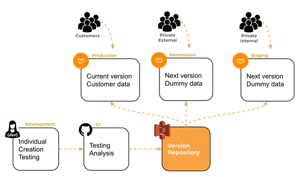
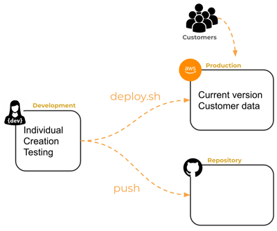

# Development

When working on a commercial web application, it is critical to separate where you develop your application, from where the production release of your application is made publicly available. Often times there are more environments than this, such as staging, internal testing, and external testing environments. If your company is seeking third party security certification (such as SOC2 compliance) they will require that these environments are strictly separated from each other. A developer will not have access to the production environment in order to prevent a developer from nefariously manipulating an entire company asset. Instead, automated integration processes, called continuous integration (`CI`) processes, checkout the application code, [lint it](https://www.freecodecamp.org/news/what-is-linting-and-how-can-it-save-you-time/), build it, test it, stage it, test it more, and then finally, if everything checks out, **deploy** the application to the production environment, and notify the different departments in the company of the release.



For our work, you will use and manage both your _development environment_ (your personal computer) and your _production environment_ (your AWS server). However, you should never consider your production environment as a place to develop, or experiment with, your application. You may shell into the production environment to configure your server or to debug a production problem, but the deployment of your application should happen using an automated CI process. For our CI process, we will use a very simple console shell script.



## Automating your deployment

The advantage of using an automated deployment process is that it is reproducible. You don't accidentally delete a file, or misconfigure something with an stray keystroke. Also, having a automated script encourages you to iterate quickly because it is so much easier to deploy your code. You can add a small feature, deploy it out to production, and get feedback within minutes from your users.

Our deployment scripts change with each new technology that we have to deploy. Initially, they just copy up a directory of HTML files, but soon they include the ability to modify the configuration of your web server, run transpiler tools, and bundle your code into a deployable package.

You run a deployment script from a console window in your development environment with a command like the following.

```sh
./deployService.sh -k ~/prod.pem -h yourdomain.click -s simon
```

The `-k` parameter provides the credential file necessary to access your production environment. The `-h` parameter is the domain name of your production environment. The `-s` parameter represents the name of the application you are deploying (either `simon` or `startup`).

This will make more sense as we gradually build up our technologies but we can discuss our simon-service deployment script as an example of what they will do. You can view the [entire file here](https://github.com/webprogramming260/simon-service/blob/main/deployService.sh), but we will explain each step below. It isn't critical that you deeply understand everything in the script, but the more you do understand the easier it will be for you to track down and fix problems when they arise.

The first part of the script simply parses the command line parameters so that we can pass in the production environment's security key (or PEM key), the hostname of your domain, and the name of the service you are deploying.

```sh
while getopts k:h:s: flag
do
    case "${flag}" in
        k) key=${OPTARG};;
        h) hostname=${OPTARG};;
        s) service=${OPTARG};;
    esac
done

if [[ -z "$key" || -z "$hostname" || -z "$service" ]]; then
    printf "\nMissing required parameter.\n"
    printf "  syntax: deployService.sh -k <pem key file> -h <hostname> -s <service>\n\n"
    exit 1
fi

printf "\n----> Deploying $service to $hostname with $key\n"
```

Next the script copies all of the applicable source files into a distribution directory (`dist`) in preparation for copying that directory to your production server.

```sh
# Step 1
printf "\n----> Build the distribution package\n"
rm -rf dist
mkdir dist
cp -r application dist
cp *.js dist
cp package* dist
```

The target directory on your production environment is deleted so that the new one can replace it. This is done by executing commands remotely using the secure shell program (`ssh`).

```sh
# Step 2
printf "\n----> Clearing out previous distribution on the target\n"
ssh -i $key ubuntu@$hostname << ENDSSH
rm -rf services/${service}
mkdir -p services/${service}
ENDSSH
```

The distribution directory is then copied to the production environment using the secure copy program (`scp`).

```sh
# Step 3
printf "\n----> Copy the distribution package to the target\n"
scp -r -i $key dist/* ubuntu@$hostname:services/$service
```

We then use `ssh` again to execute some commands on the production environment. This installs the node packages with `npm install` and restarts the service daemon (`PM2`) that runs our web application in the production environment.

```sh
# Step 4
printf "\n----> Deploy the service on the target\n"
ssh -i $key ubuntu@$hostname << ENDSSH
cd services/${service}
npm install
pm2 restart ${service}
ENDSSH
```

Finally we clean up our development environment by deleting the distribution package.

```sh
# Step 5
printf "\n----> Removing local copy of the distribution package\n"
rm -rf dist
```

Can you imagine if you had to do all of that by hand every time? You would dread deploying and would most likely make several time consuming mistakes during the process.

A deployment script exists for each of the Simon projects and you can use them, as is, for your startup application as long as you are doing similar types of deployment actions.

If you want to learn more about shell scripting you can [read this tutorial](https://ryanstutorials.net/bash-scripting-tutorial/bash-script.php). Shell scripting is a powerful tool for automating common development tasks and is well worth adding to your bucket of skills.
