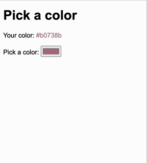

# Reactivity

Making the UI react to changes in user input or data, is one of the architectural foundations of React. React enables reactivity with three major pieces of a React component: `props`, `state`, and `render`.

React keeps a **table** of `state` values for every component. React records requested state in the table whenever a `updateState` method is called. Then periodically, React will rerender every component that has had a change since the last render occurred.

The following example contains two components: a parent `<ColorPicker/>` component and a child `<Result/>` component. The _ColorPicker_ has a state named `color`. The _Result_ has a property named `selectedColor`. The ColorPicker passes its `color` state to the Result as the `selectedColor` property. This means that any change to the ColorPicker's color is also reflected in the Result's color. Using properties is a powerful means for a parent to control a child's functionality.


Be careful about your assumptions of when state is updated. Just because you called `updateState` does not mean that you can access the updated state on the next line of code. Updates happen asynchronously, and therefore you never really know when it is going to happen. You only know that it will eventually happen.

```jsx
function ColorPicker() {
  const [color, updateColor] = React.useState('#737AB0');

  function onChange(e) {
    updateColor(e.target.value);
  }

  return (
    <div>
      <h1>Pick a color</h1>
      <Result selectedColor={color} />

      <p>
        <span>Pick a color: </span>
        <input type="color" onChange={onChange} value={color} />
      </p>
    </div>
  );
}

function Result({ selectedColor }) {
  return (
    <div>
      <p>
        Your color: <span style={{ color: selectedColor }}>{selectedColor}</span>
      </p>
    </div>
  );
}
```

### Naive React replacement

One good way to better understand a technology is to try to rewrite it. Let's substitute the reactivity part of React for the ColorPicker component. We start by replacing React's internal state variables with global variables that represent the current and next `color` state.

We then overwrite the `React.useState` function to use our global color variables and provide an update function in the return value.

Finally, we set a timer, using `setInterval`, to check to see if the color state has changed, and if so, update the state and rerender the component.

```js
let color;
let colorNext;

React.useState = (defaultValue) => {
  color = color || defaultValue;
  const update = (newColor) => (colorNext = newColor);
  return [color, update];
};

setInterval(() => {
  if (colorNext && color !== colorNext) {
    color = colorNext;
    root.render(ColorPicker());
  }
}, 50);

const root = ReactDOM.createRoot(document.getElementById('root'));
root.render(ColorPicker());
```

This is a very simplified version of React. The real implementation is much more generalized and performant. However, it does work as demonstrated by the following video.



## ☑ Assignment

Create a fork of this [CodePen](https://codepen.io/leesjensen/pen/NWzYzXE) and experiment. Try changing the input from using the color picker, to using an text input that reactively displays the text as you type.

Don't forget to update your GitHub startup repository `notes.md` with all of the things you learned and want to remember.

_If your section of this course requires that you submit assignments for grading_: Submit your CodePen URL to the Canvas assignment.

### 🧧 Possible solution

If you get stuck here is a possible solution.

```jsx
function ColorPicker() {
  const [text, updateText] = React.useState('red');

  function onChange(e) {
    updateText(e.target.value);
  }
  return (
    <div>
      <h1>Survey</h1>
      <Result selectedColor={text} />

      <p>
        <span>Type some text: </span>
        <input type="text" onChange={onChange} defaultValue="red" />
      </p>
    </div>
  );
}

function Result({ selectedColor }) {
  return (
    <div>
      <p>
        Your color:
        <span style={{ color: selectedColor }}>{selectedColor}</span>
      </p>
    </div>
  );
}
```
