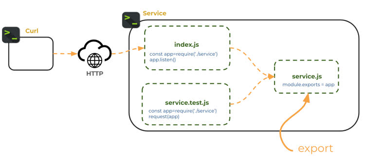
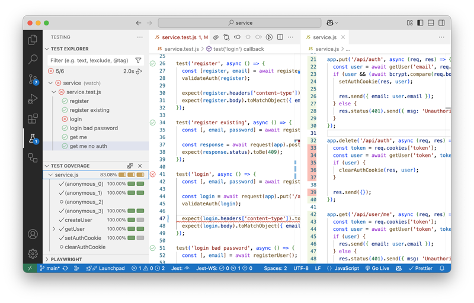

# Endpoint testing

Using test driven development (TDD) for testing service endpoints is a common industry practice. Testing services is usually easier than writing UI tests because it does not require a browser. However, it does still take effort to learn how to write tests that are effective and efficient. Making this a standard part of your development process will give you a significant advantage as you progress in your professional career.

As demonstrated by the following [State of JS](https://2021.stateofjs.com/en-US/libraries/testing/) survey, there are lots of good testing packages that work well with Express driven services. We are going to look at the current champion [Jest](https://jestjs.io/).


## Getting a service to test

To get started with Jest we need a simple web service. We can reuse the **Login** application that we built when discussing authentication services. This is a simple React application that provides register, login, logout, and a single **getMe** secure endpoint. Go ahead and copy the code from the [Login instruction](../login/exampleCode/login/service), and run NPM install. The code should consist of two files: `package.json` and `service.js`.

```sh
├── package.json
└── service.js
```

## Reconfiguring the service for test

In order to allow Jest to start up the HTTP server when running tests, we initialize the application a little bit differently than we have in the past. Normally, we would have just started listening on the Express `app` object after we defined our endpoints. Instead we **export** the Express `app` object from our `server.js` file and then import the app object in the `index.js` file that is used to run our service.

**service.js**

```js
const express = require('express');
const app = express();

// ... service code

module.exports = app;
```

**index.js**

```js
const app = require('./server');

const port = 3000;
app.listen(port, function () {
  console.log(`Listening on port ${port}`);
});
```

Breaking apart the definition of the service from the starting of the service allows us to start the service both when we run normally and also when using our testing framework.



You can verify that the service is working properly by running the service in the VS Code debugger and pressing F5 while viewing the `index.js` file. Then open a browser and navigate to `http://localhost:3000/api/user/me`. This should return that you are unauthorized. Stop the debugging session once you have demonstrated that the service is working correctly.

## Creating the first test

Jest looks for tests in any file that has a suffix of `.test.js`. Let's go ahead a create a file named `service.test.js` and create a basic Jest `test` function. Note that you don't need to include a `require` statement to import Jest functions into your code. Jest will automatically import itself when it discovers a test file.

```js
test('that equal values are equal', () => {
  expect(false).toBe(true);
});
```

The `test` function takes a description as the first parameter. The description is meant to be human readable. In this case it reads: "test that equal values are equal". The second parameter is the function to call. Our function just calls the Jest `expect` function and chains it to the `toBe` function. You can read this as "expect false to be true", which of course is not true, but we want to see our test fail the first time we run it. We will fix this later so that we can show what happens when a test succeeds.

In order to run the test we need to install the Jest package using NPM. From the console install the package. The `-D` parameter tells NPM to install Jest as a development package. That keeps it from being included when we do production release builds.

```sh
npm install jest -D
```

Now, replace the `scripts` section of the `package.json` file with a new command that will run our tests with Jest.

```json
"scripts": {
  "test": "jest"
},
```

With that in place we can run the `test` command and our test will execute. Notice that Jest shows exactly where the test failed and what expected values were not received.

```sh
➜ npm run test

 FAIL  ./service.test.js
  ✕ that unequal values are not equal (1 ms)

  ● that unequal values are not equal

    expect(received).toBe(expected) // Object.is equality

    Expected: true
    Received: false

      3 |
      4 | test('that unequal values are not equal', () => {
    > 5 |   expect(false).toBe(true);
        |                 ^
      6 | });
      7 |
      8 | // describe('endpoints', () => {

      at Object.toBe (service.test.js:5:17)

Tests:       1 failed, 1 total
```

We can then fix our test by rewriting it so that the expected value matches the provided value.

**service.test.js**

```js
test('that equal values are equal', () => {
  expect(true).toBe(true);
});
```

This time when we run the test it passes.

```sh
➜  npm run test

 PASS  ./service.test.js
  ✓ that equal values are equal (1 ms)

Tests:       1 passed, 1 total
```

Note that this example didn't actually test any of our code, but it does demonstrate how easy it is to write tests. A real test function would call code in your program. Let's do this by actually making calls to our endpoints.

## Testing endpoints

To test our endpoints we need another NPM package so that we can make HTTP requests without having to actually send them over the network. This is done with the `supertest` NPM package. Go ahead and install this now as a development dependency.

```sh
npm install supertest -D
```

No go and alter `services.test.js` to import the login service and `supertest` so that we can mock out HTTP requests.

To make an HTTP request, you pass the service `app` to the supertest `request` function and then chain on the HTTP verb function that you want to call, along with the endpoint path. You can then chain on as many `expect` functions as you would like. In the following example, we call the `register` endpoint and expect get back an HTTP status code of 200 (OK) along with the correct headers and body.

**service.test.js**

```js
const request = require('supertest');
const app = require('./server');

test('register simple', async () => {
  const email = 'test@email.com';
  const password = 'toomanysecrets';
  const register = await request(app).post('/api/auth').send({ email, password });

  expect(register.headers['content-type']).toMatch('application/json; charset=utf-8');
  expect(register.body).toMatchObject({ email });
});
```

When we run this test we see that it passes without error.

```sh
➜  npm run test

 PASS  ./service.test.js
  ✓ register simple returns the desired store (16 ms)

Test Suites: 1 passed, 1 total
Tests:       1 passed, 1 total
Snapshots:   0 total
Time:        0.237 s, estimated 1 s
```

## Basic testing methodology

In a very real way testing code is no different than application code. When you are writing tests, you are simply writing a program whose purpose is to test another program. For this reason, you should practice the same craftsmanship with your testing code. It should be well designed, performant, and maintainable. Here are some characteristics of good tests:

- Test only one thing
- Don't repeat tests that are already covered elsewhere
- Naturally supported by the application code
- Tests are readable
- Test can run in any order
- Test can run concurrently

## Creating testing utility functions

As your test become more complex you will want to create utility functions so that you don't repeatedly assert the same thing or copy the code necessary to setup a test. Let's rewrite the `register` test so that we can reuse the registration function when we test other endpoints such as login or logout.

```js
function getRandomName(prefix) {
  return `${prefix}_${Math.random().toString(36).substring(2, 15)}`;
}

async function registerUser() {
  const email = getRandomName('email');
  const password = 'toomanysecrets';
  const response = await request(app).post('/api/auth').send({ email, password });

  return [response, email, password];
}

test('register', async () => {
  const [register, email] = await registerUser();

  expect(register.headers['content-type']).toMatch('application/json; charset=utf-8');
  expect(register.body).toMatchObject({ email });
});
```

This code is generalized so that we use different user email addresses for each test and simplifies the test down to just the lines necessary to clearly represent the register test.

Now we can reuse the utility functions to write a test that tries to register the same user twice and also write a login test.

```js
test('register existing', async () => {
  const [, email, password] = await registerUser();

  const response = await request(app).post('/api/auth').send({ email, password });
  expect(response.status).toBe(409);
});

test('login', async () => {
  const [, email, password] = await registerUser();

  const login = await request(app).put('/api/auth').send({ email, password });
  validateAuth(login);

  expect(login.headers['content-type']).toMatch('application/json; charset=utf-8');
  expect(login.body).toMatchObject({ email });
});
```

## Testing with cookies

Our register test is missing once critical validation. It doesn't assert that the endpoint returned a cookie that contains the authentication token. We can fix that by creating a `validateAuth` utility function and calling it from the test.

```js
function validateAuth(response) {
  expect(response).toBeDefined();
  expect(response.status).toBe(200);
  const cookie = response.headers['set-cookie'];
  expect(cookie).toBeDefined();
  const uuidRegex = /^token=[0-9a-f]{8}-[0-9a-f]{4}-[0-9a-f]{4}-[0-9a-f]{4}-[0-9a-f]{12}.*$/i;
  const token = cookie.find((c) => c.match(uuidRegex));
  expect(token).toBeDefined();
}

test('register', async () => {
  const [register, email] = await registerUser();
  validateAuth(register);

  expect(register.headers['content-type']).toMatch('application/json; charset=utf-8');
  expect(register.body).toMatchObject({ email });
});
```

We can also test an endpoint that requires authentication by first registering a user and then passing the cookie along with the call to the `getMe` endpoint.

```js
test('get me', async () => {
  const [register, email] = await registerUser();

  const cookie = register.headers['set-cookie'];
  const getMe = await request(app).get('/api/user/me').set('Cookie', cookie);
  expect(getMe.status).toBe(200);
  expect(getMe.headers['content-type']).toMatch('application/json; charset=utf-8');
  expect(getMe.body).toMatchObject({ email });
});
```

## Coverage

Determining how many lines of your application code are called by your testing code is called coverage. Generally you want enough coverage to give you confidence that your code does what you think it does without having to manually test everything each time you make a change to the code.

You enabling coverage with Jest by creating a file name `jest.config.json` with the following content:

```json
{
  "collectCoverage": true,
  "coverageThreshold": {
    "global": {
      "lines": 80
    }
  }
}
```

Now when you run the tests that we have created so far you will get a coverage report. The report tells which lines are not covered and the total coverage percentage. Because we specified that at least 80% of the lines must be covered you get an error that we only cover 68.18%

```sh
npm run test

 PASS  ./service.test.js
  ✓ register (72 ms)
  ✓ register existing (54 ms)
  ✓ get me (54 ms)

------------|---------|----------|---------|---------|-------------------------
File        | % Stmts | % Branch | % Funcs | % Lines | Uncovered Line #s
------------|---------|----------|---------|---------|-------------------------
All files   |   68.88 |    33.33 |   66.66 |   68.18 |
 service.js |   68.88 |    33.33 |   66.66 |   68.18 | 22-28,33-39,48,71,85-86
------------|---------|----------|---------|---------|-------------------------
Jest: "global" coverage threshold for lines (80%) not met: 68.18%
```

You can go ahead and get practice with Jest by continue writing tests until you reach the desired target. If you don't want to go through the work yourself, you can view a [solution](exampleCode/login/service/service.test.js) that achieves 100% coverage.

## VS Code Jest extension

You can use the VS Code Jest extension to visualize what tests are passing, automatically run tests whenever your code changes, run a test with a click of a button, see what lines of code are covered, and get inline feedback about failing tests.



## Test driven development

The great thing about test driven development (TDD) is that you can actually write your tests first and then write your code based upon the design represented by the tests. When your tests pass you know your code is complete. Additionally, when you make later modifications to your code you can simply run your tests again. If they pass then you can be confident that your code is still working without having to manually test everything yourself. With systems that have hundreds of endpoints and hundreds of thousands of lines of code, TDD becomes an indispensable part of the development process.
