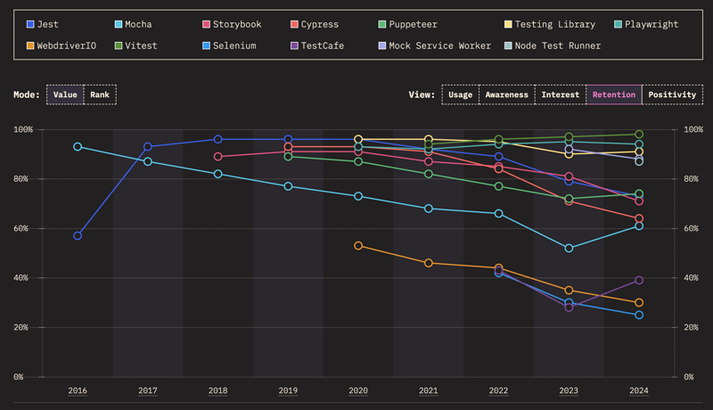
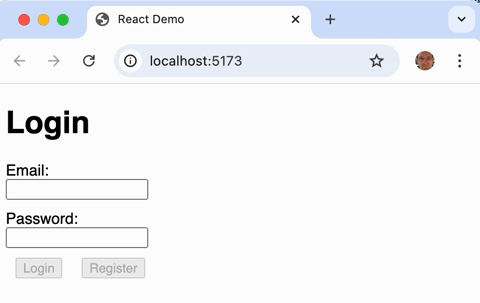
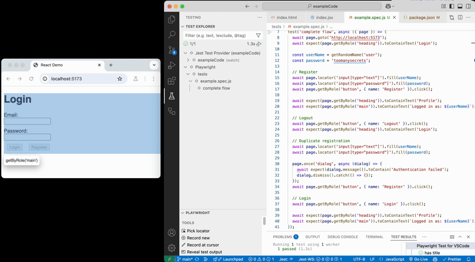

# Frontend testing

[Test driven development](https://www.freecodecamp.org/news/test-driven-development-what-it-is-and-what-it-is-not-41fa6bca02a2/) (TDD) is a proven methodology for accelerating application creation, protecting against regression bugs, and demonstrating correctness. TDD for console based applications and server based code is fairly straight forward. Web application frontend code is significantly more complex to test, and using automated tests to drive your UI development is even more difficult.

The problem is that a browser is required to execute UI code. That means you have to actually test the application in the browser. Additionally, every one of the major browsers behaves slightly differently, viewport size makes a big difference, all the code executes asynchronously, network disruptions are common, and then there is the human factor. A human will interact with the browser in very unexpected ways. Clicking where they shouldn't, clicking rapidly, randomly refreshing the browser, flushing cache, not flushing cache, leaving the application up for days on end, switching between tabs, opening the application multiple times, logging in on different tabs, logging out of one tab while still using the application on another tab, or ... on and on. And we haven't even talked about running all the different browsers on all of the possible devices.

Of course the alternative to not test your code doesn't work either. That only means that you have to manually test everything every time you make any change, or you let your users test everything. That is not a good recipe for long term success.

Fortunately this is a problem that many strong players have been working on for decades now, and the solutions, while not perfect, are getting better and better. We will look at two of these solutions. One is for executing automated tests in the browser, and the other is for testing on different browsers and devices.

## Automating the browser - Playwright

📖 **Deeper dive reading**: [Playwright and VS Code](https://playwright.dev/docs/getting-started-VSCode)

No one understands the difficulty of testing applications in a browser better than the companies that build web browsers. They have to test every possible use of HTML, CSS, and JavaScript that a user could think of. There is no way that manual testing is going to work and so early on they started putting hooks into their browsers that allowed them to be driven from automated external processes. [Selenium](https://www.selenium.dev/) was introduced in 2004 as the first popular tool to automate the browser. However, Selenium is generally considered to be flaky and slow. Flakiness means that a test fails in unpredictable, unreproducible ways. When you need thousands of tests to pass before you can deploy a new feature, even a little flakiness becomes a big problem. If those tests take hours to run then you have an even bigger problem.

The market now has lots of alternatives when considering which automated browser framework to use. [State of JS](https://stateofjs.com/) includes statistics on how popular these frameworks are. With frameworks coming and going all of the time, one telling statistic is the frameworks' ability to retain users.



— Retention of browser based testing frameworks (**Source**: _2024.stateofjs.com_)

## Demonstration application

For the purposes of this instruction, we could pick any of the top contenders. However, we are going to pick a newcomer, [Playwright](https://playwright.dev/). Playwright has some major advantages. It is backed by Microsoft, it integrates really well with VS Code, and it runs as a Node.js process. It is also considered one of the least flaky of the testing frameworks.



As a demonstration of using Playwright, we will use the [Login application](../login/exampleCode/login) that we used to demonstrate backend testing. The JSX for the application allows for the ability to provide an email and password for login or registration.

```jsx
<div>
  <h1>Login</h1>
  <div>
    <label>Email:</label>
    <input type='text' onChange={(e) => setEmail(e.target.value)} required />
  </div>
  <div>
    <label>Password:</label>
    <input type='password' onChange={(e) => setPassword(e.target.value)} required />
  </div>
  <button type='submit' disabled={!(email && password)} onClick={handleLogin}>
    Login
  </button>
  <button type='button' disabled={!(email && password)} onClick={handleRegister}>
    Register
  </button>
</div>
```

## Installing Playwright

With our demonstration app created we are ready to install Playwright. When going through the installation steps, choose TypeScript, `tests` for the test directory, ignore the GitHub Actions workflow for now, and do not install any Playwright browsers.

```sh
npm init playwright@latest
```

This will update `package.json` with the `playwright` package, create a `playwright.config.ts` file, and create some sample tests in the `test` and `tests-examples` directories. This will also update your `.gitignore` file so that you don't accidentally check in test coverage or report information.

### Install a testing browser

Now replace the contents of the Playwright configuration file `playwright.config.ts` with the following:

```js
import { defineConfig, devices } from '@playwright/test';

export default defineConfig({
  testDir: './tests',
  fullyParallel: true,
  forbidOnly: !!process.env.CI,
  retries: process.env.CI ? 2 : 0,
  workers: process.env.CI ? 1 : undefined,
  reporter: 'html',
  timeout: 5000,
  use: {
    baseURL: 'http://localhost:5173',
    trace: 'on-first-retry',
  },

  /* Configure projects for major browsers */
  projects: [
    {
      name: 'chromium',
      use: { ...devices['Desktop Chrome'], viewport: { width: 800, height: 600 } },
    },
  ],

  /* Run your local dev server before starting the tests */
  webServer: {
    command: 'npm run dev',
    url: 'http://localhost:5173',
    reuseExistingServer: !process.env.CI,
    timeout: 5000,
  },
});
```

This simplifies the configuration to only use the Chromium browser driver and launches the Login application when the tests run.

Next, you need to install the Playwright Chromium driver with the following command.

```sh
npx playwright install --with-deps chromium
```

Finally, modify `package.json` to include a script for running playwright for your tests.

```json
"scripts": {
  "dev": "vite",
  "test": "playwright test"
},
```

## Running your first test

The easiest way to run your first Playwright test is to start with the examples that came with the Playwright installation.

```sh
└── tests
    └── example.spec.ts

```

Playwright will run any test found in the testing directory as defined by the `testDir` property in the `playwright.config.ts` file. You chose `tests` to be the testing directory during the installation. Playwright follows the common convention of including `.spec.` in test names. You can also use `.test.` if you want to be consistent with your Jest tests.

After review the provided tests, replace the tests found in `tests/example.spec.ts` with the following:

```js
import { test, expect } from '@playwright/test';

test('has title', async ({ page }) => {
  await page.goto('http://localhost:5173');
  await expect(page.getByRole('heading')).toContainText('Login');
});
```

This test navigates to the Login website and checks to make sure the resulting page has the title `Playwright`. You can run the tests from your project directory with the following console command.

```sh
npm test

Running 1 test using 1 worker
  1 passed (1.4s)
```

**Congratulations!** You have just ran your first Playwright test. You can validate that the test is working by changing the expected text to 'Bad' instead of 'Login' and then running the test again. This time it should fail.

## Complete test

Now that we are confident that we can use Playwright to run a test, let's write a more complex one that goes through the whole register/logout/login flow.

```js
import { test, expect } from '@playwright/test';

function getRandomName(prefix) {
  return `${prefix}_${Math.random().toString(36).substring(2, 15)}`;
}

test('complete flow', async ({ page }) => {
  await page.goto('http://localhost:5173');
  await expect(page.getByRole('heading')).toContainText('Login');

  const userName = getRandomName('user');

  // Register
  await page.locator('input[type="text"]').fill(userName);
  await page.locator('input[type="password"]').fill('toomanysecrets');
  await page.getByRole('button', { name: 'Register' }).click();

  await expect(page.getByRole('heading')).toContainText('Profile');
  await expect(page.getByRole('main')).toContainText(`Logged in as: ${userName}`);

  // Logout
  await page.getByRole('button', { name: 'Logout' }).click();
  await expect(page.getByRole('heading')).toContainText('Login');

  // Duplicate registration
  await page.locator('input[type="text"]').fill(userName);
  await page.locator('input[type="password"]').fill('toomanysecrets');

  page.once('dialog', async (dialog) => {
    await expect(dialog.message()).toContain('Authentication failed');
    dialog.dismiss().catch(() => {});
  });
  await page.getByRole('button', { name: 'Register' }).click();

  // Login
  await page.getByRole('button', { name: 'Login' }).click();

  await expect(page.getByRole('heading')).toContainText('Profile');
  await expect(page.getByRole('main')).toContainText(`Logged in as: ${userName}`);
});
```

This is just a simple example of the powerful functionality of Playwright. You are encouraged to explore its functionality and even add some tests to your projects. Once you have gained some competency with Playwright you will find that you can write your code faster and feel more confident when changing things around.

## VS Code Playwright extension

You can use the VS Code Playwright extension to record tests using the browser, visualize what tests are passing, automatically run tests whenever your code changes, and debug a test with a click of a button.



## Testing various devices - BrowserStack

With the ability to run automated UI tests, we now turn our attention to testing on the multitude of various devices. There are several services out there that help with this. One of these is [BrowserStack](https://www.browserstack.com/). BrowserStack lets you pick from a long list of physical devices that you can run interactively, or use when driving automated tests with Selenium. The image below only shows a partial list of iPhone devices. BrowserStack also has devices for Android, Mac, and Windows.


When you launch a device it connects the browser interface to a physical device hosted in a data center. You can then use the device to reproduce user reported problems, or validate that your implementation works on that specific device. The following image shows the use of BrowserStack to experiment with an iPhone 14 running iOS 16.


BrowserStack offers free trials if you would like to see how your startup application works on a specific device.
