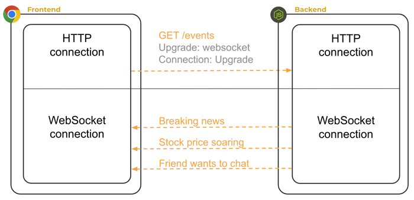

# WebSocket


HTTP is based on a client-server architecture. A client always initiates the request and the server responds. This is great if you are building a global document library connected by hyperlinks, but for many other use cases it just doesn't work. Applications for notifications, distributed task processing, peer-to-peer communication, or asynchronous events need communication that is initiated by two or more connected devices.

For years, web developers created hacks to work around the limitation of the client/server model. This included solutions like having the client frequently pinging the server to see if the server had anything to say, or keeping client-initiated connections open for a very long time as the client waited for some event to happen on the server. Needless to say, none of these solutions were elegant or efficient.

Finally, in 2011 the communication protocol WebSocket was created to solve this problem. The core feature of WebSocket is that it is fully duplexed. This means that after the initial connection is made from a client, using vanilla HTTP, and then upgraded by the server to a WebSocket connection, the relationship changes to a peer-to-peer connection where either party can efficiently send data at any time.



This enables the server to send notifications to the client, or for the client and server to have an asynchronous exchange of information.

WebSocket connections are still only between two parties. So if you want to facilitate a conversation between a group of users, the server must act as the intermediary. Each peer first connects to the server, and then the server forwards messages amongst the peers.


## Creating a WebSocket conversation

JavaScript running on a browser can initiate a WebSocket connection with the browser's WebSocket API. Assuming the browser is addressing an appropriate host and port (e.g., localhost:9900), first you create a WebSocket object: the first line below queries the browser to determine which protocol is being used (http or https) and selects the appropriate websocket upgrade (unsecure or secure, respectively); the second line creates the WebSocket object, using the selected protocol and the hostname and port currently being used by the browser:

```js
const protocol = window.location.protocol === 'http:' ? 'ws' : 'wss';
const socket = new WebSocket(`${protocol}://${window.location.host}`);
```

You can then register a callback using the `onmessage` function to specify how to handle incoming messages (does this look like an event listener?):

```js
socket.onmessage = (event) => {
  console.log('received: ', event.data);
};
```

and, you can send messages using the `send` function:

```js
socket.send('I am listening');
```

The server uses the `ws` package to create a WebSocketServer that is listening on the same port the browser is using. By specifying a port when you create the WebSocketServer, you are telling the server to listen for HTTP connections on that port and to automatically upgrade them to a WebSocket connection if the request has a `connection: Upgrade` header.

When a connection is detected it calls the server's `on connection` callback. The server can then send messages with the `send` function, and register a callback using the `on message` function to receive messages.

```js
const { WebSocketServer } = require('ws');

const wss = new WebSocketServer({ port: 3000 });

wss.on('connection', (ws) => {
  ws.on('message', (data) => {
    const msg = String.fromCharCode(...data);
    console.log('received: %s', msg);

    ws.send(`I heard you say "${msg}"`);
  });

  ws.send('Hello webSocket');
});
```

In a later instruction we will show you how to run and debug this example.
